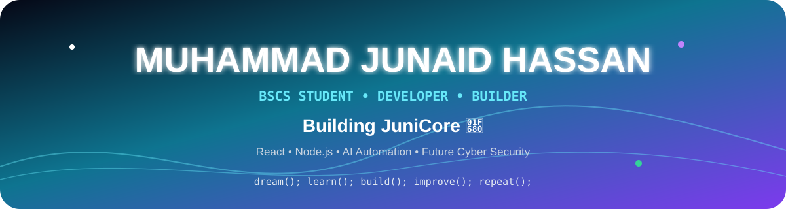
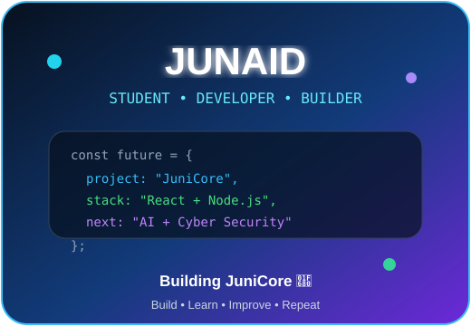

<div align="center">



<br><br>


<br>


</div>

---

## 🌟 About Me

<table>
<tr>
<td width="58%" valign="top">

- 🎓 BS Computer Science student at **UMT Lahore**
- 🚀 Building **JuniCore** — my long-term education technology platform
- ⚛️ Converting projects into **React** component-based applications
- 🟢 Learning **Node.js, Express.js, APIs and backend development**
- 🤖 Exploring **AI Automation**
- 🔐 Long-term direction: **Cyber Security / Security Engineering**
- 📈 Focused on **real-world projects, consistency and growth**

</td>
<td width="42%" align="center" valign="middle">



</td>
</tr>
</table>

---

## 🚀 My Main Project — JuniCore

<div align="center">


**A multi-institution education management platform for Schools, Colleges and Universities.**

</div>

### 🔄 Development Journey

<div align="center">


</div>

```text
UI / UX Design
      ↓
HTML + Tailwind CSS
      ↓
React Conversion
      ↓
Node.js + Express Backend
      ↓
MongoDB + REST APIs
      ↓
Authentication + Role-Based Access
      ↓
Cloud Deployment
      ↓
Security + AI Automation
```

### 🎯 JuniCore Vision

<table>
<tr>
<td align="center">🏫<br><b>Schools</b></td>
<td align="center">🏢<br><b>Colleges</b></td>
<td align="center">🎓<br><b>Universities</b></td>
<td align="center">👥<br><b>Role Portals</b></td>
</tr>
<tr>
<td align="center">📊<br>Academic Workflows</td>
<td align="center">🔐<br>Secure Access</td>
<td align="center">☁️<br>Cloud Ready</td>
<td align="center">🤖<br>AI Automation</td>
</tr>
</table>

---

## 🛠️ Tech I Work With

<div align="center">


</div>

<br>

<div align="center">


</div>

---

## 📚 Currently Learning

<table>
<tr>
<td align="center" width="20%"><b>⚛️ React</b><br><sub>Reusable UI & conversion</sub></td>
<td align="center" width="20%"><b>🟢 Node.js</b><br><sub>Backend fundamentals</sub></td>
<td align="center" width="20%"><b>🔌 APIs</b><br><sub>REST & integrations</sub></td>
<td align="center" width="20%"><b>🤖 AI</b><br><sub>Automation workflows</sub></td>
<td align="center" width="20%"><b>🔐 Cyber</b><br><sub>Future specialization</sub></td>
</tr>
</table>

---

## 📊 GitHub Activity

<div align="center">


<br><br>


</div>

---

## 🎯 Current Goals

<div align="center">


</div>

- Complete **JuniCore React conversion**
- Build the **JuniCore backend** with Node.js, Express and MongoDB
- Learn **production-ready APIs, authentication and authorization**
- Build practical **AI automation workflows**
- Learn **cloud deployment and DevOps fundamentals**
- Move toward **Cyber Security / Security Engineering** with a strong development foundation

---

## 🌐 Connect With Me

<div align="center">

<a href="https://github.com/uncommonjuni4"></a>
<a href="mailto:chjunaidhassan95@gmail.com"></a>
<a href="https://www.linkedin.com/in/uncommon-juni/"></a>
<a href="https://portfilo-website-junaid.netlify.app/"></a>

</div>

---

<div align="center">


</div>
